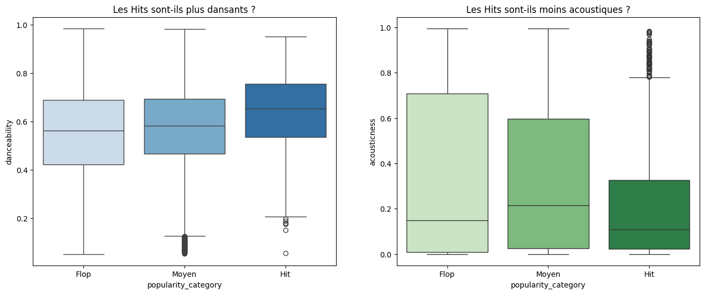
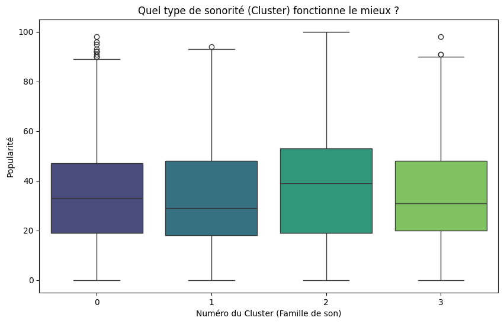

# 🎵 Analyse stratégique de données musicales (Spotify)

Lien du dataset: https://www.kaggle.com/datasets/maharshipandya/-spotify-tracks-dataset

## Contexte du projet
Ce projet a été réalisé dans le cadre de mon évaluation en "Atelier Développement".
En tant qu'analyste de données, j'ai choisi d'étudier un catalogue de **114 000 titres Spotify** pour comprendre les mécanismes de la viralité musicale.

Mon objectif était de répondre à la problématique suivante :
> **"Dans quelle mesure les caractéristiques acoustiques (tempo, énergie, danceability) influencent-elles la popularité d'un titre ?"**

---

## Méthodologie & nettoyage
Pour garantir la fiabilité de mes résultats, j'ai d'abord effectué un nettoyage rigoureux des données brutes :
* **Nettoyage :** Suppression de 24 000 doublons et des données aberrantes (titres de 0 seconde ou 0 BPM).
* **Feature Engineering :** Transformation des unités (durée en minutes) et segmentation de la popularité en catégories (*Flop*, *Moyen*, *Hit*) pour faciliter les comparaisons.
* **Volume final :** L'analyse porte sur un échantillon propre de **89 000 titres uniques**.

---

## Analyse exploratoire
J'ai mené l'enquête à travers trois axes d'analyse :

### 1. Recherche de corrélations (Heatmap)
J'ai cherché des liens mathématiques directs entre la technique audio et le succès.
* **Résultat :** Aucune corrélation forte n'a été trouvée (coefficients < 0.2). Cela prouve qu'il n'existe pas de "recette magique" simple (ex: "plus c'est rapide, plus ça marche").

### 2. Comparaison Hits vs Flops
J'ai comparé les profils techniques des Top Titres (Top 10%) face aux échecs commerciaux.
* **Résultat :** Les Hits sont légèrement plus dansants, mais les caractéristiques techniques se chevauchent beaucoup.

### 3. Clustering avancé (K-Means)
J'ai utilisé un algorithme d'apprentissage non-supervisé pour regrouper les chansons par "ambiance" (Clusters) plutôt que par genre.
* **Résultat :** J'ai identifié 4 familles de sons distinctes (Joyeux (0), Acoustique (1), Sombre/Rythmé (2), Agressif (3)).

---

## 3 insights clés (Résultats)
Voici les conclusions stratégiques que je tire de cette analyse :

1.  **L'opportunité "Dark Dance" (Cluster 2) :**
    Contrairement aux idées reçues, les musiques joyeuses ne sont pas les plus populaires. Mon clustering montre que les titres **rythmés mais sombres/mélancoliques** (faible valence, forte danceability) obtiennent une popularité médiane supérieure (+10 points) aux titres acoustiques.

2.  **Le plafond de verre acoustique :**
    Les données montrent une pénalité structurelle pour les titres purement acoustiques (Piano/Guitare-Voix), qui sont sous-représentés parmi les "Hits". Le streaming favorise les productions avec une forte densité sonore (*Loudness*).

3.  **La domination du genre sur la technique :**
    L'analyse des genres montre que l'étiquette (ex: K-Pop, Pop-Film) est un meilleur prédicteur de succès que la qualité audio intrinsèque du morceau.

---

## Recommandations stratégiques
Si je devais conseiller un label musical sur la base de ces données :
* **Ciblage :** Miser sur l'esthétique "Dark Dance" (Rythmique urbaine + Mélodie triste) qui correspond au standard viral actuel.
* **Production :** Éviter les formats purement acoustiques pour les singles principaux (*Lead Singles*).
* **Marketing :** Ne pas chercher à calibrer un titre sur une durée précise (3min vs 4min), car cette variable n'a plus d'impact significatif sur le succès.

---

## Stack technique
* **Langage :** Python
* **Librairies :** Pandas, NumPy, Seaborn, Matplotlib, Scikit-Learn.
* **Environnement :** Google Colab.

---
*Projet réalisé par PIERRE-OLIVIER BINET - Décembre 2025*
